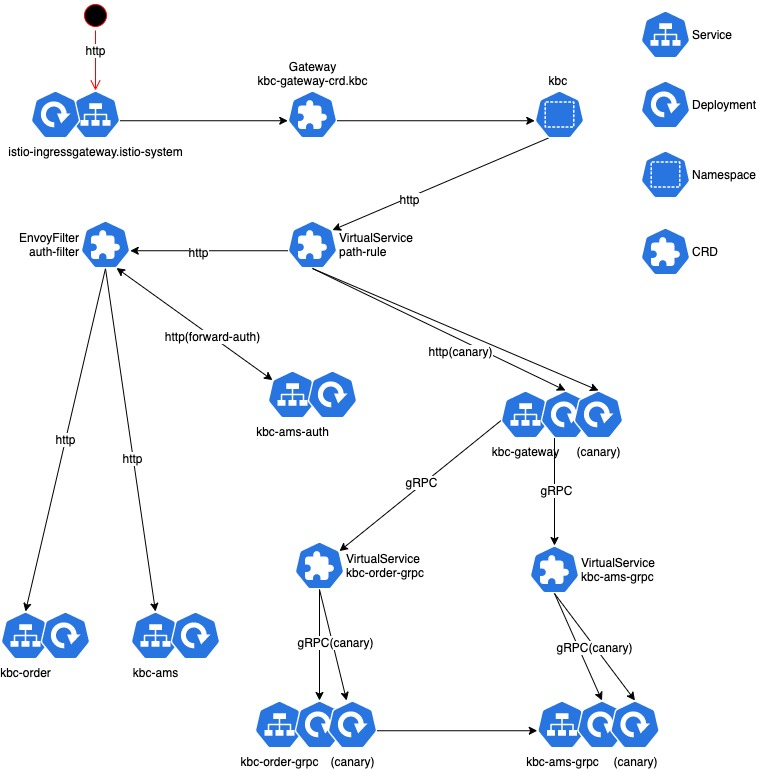

# Workshop Istio
## Content
* [Deploy microservices](#Deploy-microservices)
* [gRPC LB](#grpc-lb)
* [Sidecar Injection](#Sidecar-Injection)
* [Entry traffic](#Entry-traffic)
    * [API Gateway](#API-Gateway)
    * [Forward Auth](#Forward-Auth)
* [Service traffic](#Service-traffic)
    * [Canary Deployment](#Canary-Deployment)
    * [Retrying](#retrying)
    * [Circuit breaker](#Circuit-breaker)
* [Monitoring](#Monitoring)
* [Tracing](#Tracing)


## Deploy microservices

````shell script
export NAMESPACE=<your name>
kubectl apply -f deployment/microservices -n ${NAMESPACE}
````

## gRPC LB

1. Make forward connection
    ```shell script
    nohup kubectl port-forward service/ws001-api 8080:7001 -n ${NAMESPACE} &
    ```

1. Monitor logs
    * Pod 1
    ````shell script
     kubectl logs -f $(kubectl get pods --template '{{range .items}}{{.metadata.name}}{{"\n"}}{{end}}' -n ${NAMESPACE} -l \
        app=ws002-pingpong | sed -n 1p) -c ws002-pingpong --tail=10 -n ${NAMESPACE}
    ````
   * pod 2 
   ````shell script
    kubectl logs -f $(kubectl get pods --template '{{range .items}}{{.metadata.name}}{{"\n"}}{{end}}' -n ${NAMESPACE} -l \
       app=ws002-pingpong | sed -n 2p) -c ws002-pingpong --tail=10 -n ${NAMESPACE}
   ````

1. Test ```curl http://localhost:8080/api/pingpong```

* We found gRPC Load Balance is not available. 
* kube-proxy supports only L4, so long connection wouldn't be redispatch.


## Sidecar Injection 
* Condition
    * Deployment has metadata.labels.app label.
    * Service resource must to has spec.ports.name.
    
* Inject
    ````shell script
    # All new created pod will genarate sidecar
    kubectl label namespace $NAMESPACE  istio-injection=enabled

    # Inject all exist pod
    kubectl apply -f <(istioctl kube-inject -f deployment/workshop.yaml) -n ${NAMESPACE}

    # Deploy access log recorder
    kubectl apply -f ./deployment/http-filter/040-accesslog-filter.yaml -n ${NAMESPACE}
    ````
* back to [gRPC LB](#grpc-lb). gRPC LB has been worked well.

## Entry traffic 
* Request through API Gateway and Forward auth


### API Gateway 

1. Set up your domain in deployment/gateway.yaml 
1. Deploy gateway CRD.
    ````
    kubectl apply -f deployment/gateway.yaml -n ${NAMESPACE}
    ````
1. Get external address
    ````
    export INGRESS_HOST=$(kubectl -n istio-system get service istio-ingressgateway -o jsonpath='{.status.loadBalancer.ingress[0].ip}')
    ````
1. We set rule of host name, prefix path, let's test is it matched.
    ````
    [O] curl -HHost:<name>.workshop.com http://$INGRESS_HOST/api/pingpong 
    [X] curl   http://$INGRESS_HOST/api/pingpong 
    [X] curl -HHost:<name>.workshop.com http://$INGRESS_HOST/
     ````
### Forward Auth
* Deploy EnvoyFilter CRD
    ```shell script
    kubectl apply -f ./deployment/http-filter/030-auth-filter.yaml -n ${NAMESPACE}
    ```
* Test : ws003 service response for validate JWT, we assume 1234 is correct token
   
    ````
    curl -HHost:<name>.workshop.com -H Authorization:6666  http://$INGRESS_HOST/api/pingpong
    // response: {Code: "40300", Msg: "identity deny"}
    curl -HHost:<name>.workshop.com -H Authorization:1234  http://$INGRESS_HOST/api/pingpong
    // response {"msg": "we got auth info {user-id:1}"}
    ````
* lua httpCall() can't through virtual service rule

## Service traffic

### Retrying
* Retrying will execute in background.
* Default is enable. Turn off if you don't wanna retry.

    ```yaml
      retries:
        attempts: 5
        perTryTimeout: 10s
        retryOn: unavailable,cancelled
    ```

* Test with injecting error

    ```
    grpcurl  -plaintext -d '{"InjectTimeout": "0", "InjectErrorCode": "1"}' ws002-pingpong:7002 pingpong.PingPongService/PingPongEndpoint
    ```

### Circuit breaker
* Remove from Loading pool when match condition.
    ```yaml
      http:
        maxRequestsPerConnection: 5
    outlierDetection:
      consecutiveErrors: 1
      interval: 1s
      baseEjectionTime: 3s
      maxEjectionPercent: 100
    ```

* Have a simple stress test 
    ````bash
    xargs -I $ -n1  -P10  sh -c "grpcurl -plaintext -d '{\"InjectTimeout\": \"5\", \"InjectErrorCode\": \"0\"}' ws002-pingpong:7002 pingpong.PingPongService/PingPongEndpoint" \
    < <(printf '%s\n' {1..10})
    ````


### Canary Deployment
* We can adjust weight in virtual service
    ````
     kubectl apply -f deployment/microservices/020-virtual-service.yaml -n ares  
    ````
* Example of Blue/Green deployment flow：

    |steps| |Blue weight|Green weight|Blue replica|  Green replica|
    |---|---|---|---|---|---|
    |1|Before deployment|100%|0%| 2|0|
    |2|Deploy on Green|100%|0%| 2|2(new version)|
    |4|Switch all traffic|0%|100%| 2|2|
    |5|Release old pods when stable |0%|100%| 0|2|

## Monitoring
* Make a connection to prometheus
    ````
     nohup kubectl -n istio-system port-forward $(kubectl -n istio-system get pod -l app=prometheus -o jsonpath='{.items[0].metadata.name}') 9090:9090 &
    ````

* Watch the request metrics of ws002-pingpong service on http://127.0.0.1:9090/
    ````
    istio_requests_total{destination_service="ws002-pingpong.<namesapce>.svc.cluster.local"}
    ````
* refer [envoy metrics](https://www.servicemesher.com/envoy/configuration/cluster_manager/cluster_stats.html) 


## Tracing
* We have to redirect B3-tracing header from http to gRPC
    * Redirecting header. refer [injectHeadersIntoMetadata](ws001-api/main.go)
* Make a connection to jaeger 
    ````
    nohup kubectl -n istio-system port-forward $(kubectl -n istio-system get pod -l app=jaeger -o jsonpath='{.items[0].metadata.name}') 15032:16686 &
    ````
* Hit endpoint
    ````sh
    curl -HHost:<name>.workshop.com http://$INGRESS_HOST/api/pingpong
    ````
* Goto http://localhost:15032/ and select your namespace

